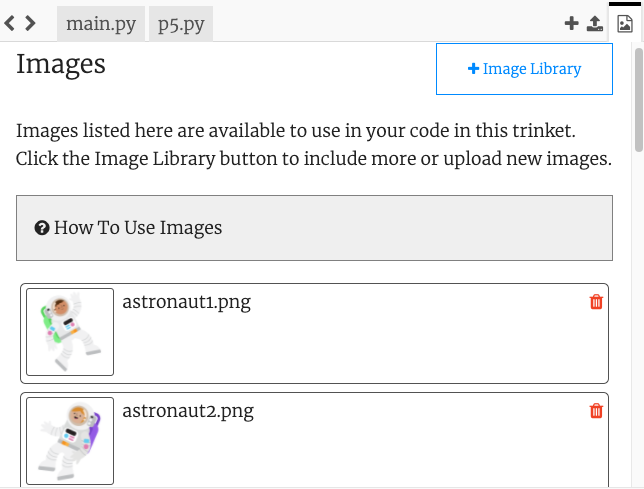

## テーマを設定する

<div style="display: flex; flex-wrap: wrap">
<div style="flex-basis: 200px; flex-grow: 1; margin-right: 15px;">
ゲームのテーマを設定し、マウスポインタを追いかけるプレイヤーキャラクターを作成します。

</div>
<div>

{:width="300px"}

</div>
</div>

あなたのゲームのテーマは何ですか？ あなたが望むものを何でも選ぶことができます。 たとえば、こんなアイデアがあります。
- スポーツや趣味
- 映画、ショー、またはゲーム
- 科学や自然
- そのほか何でも！

--- task ---

[スタータープロジェクト](https://trinket.io/python/cda05e5911){:target="_blank"}を開きます。 Trinketは別のブラウザタブで開きます。

--- /task ---

--- task ---

**選択：** キャンバスのサイズを設定します。

--- code ---
---
language: python
filename: main.py - setup()
---

def setup():    
    size(400, 400)


--- /code ---

--- /task ---

--- task ---

ゲームのテーマに基づい背景の色を保存するために、 `safe` という変数を作成します。

これは、プレーヤーが安全に過ごせる場所の色です。この変数は、あとでまた使います。

--- code ---
---
language: python
filename: main.py - draw()
---

def draw():    
    safe = color(200, 100, 0) #テーマの色   
    background(safe)

--- /code ---

[[[generic-theory-simple-colours]]]

--- /task ---

--- task ---

**テスト：**コードを実行して、背景の色を確認します。 画面の色とサイズを満足するまで変更します。

--- /task ---

次に、ゲームをプレイして障害物を避けるキャラクターを選びます。 物、人、動物、または何か他のものを選びますか？

プレーヤーは、固定の `y` 位置とマウスポインターと同じ `x`の位置に表示されます。この位置は、 `p5`の変数 `mouse_x` に格納されています。

--- task ---

プレイヤーキャラクターを描くためのコードを関数にまとめるのは良いアイデアです。

`draw_player()` 関数を定義し、プレーヤーの固定の`y` 位置用に`player_y`変数を作成し作成します。

--- code ---
---
language: python
filename: main.py - draw_player()
---

def draw_player():    
  player_y = int(height * 0.8) #画面の下の方に置く

--- /code ---

`draw()` にコードを追加して、フレームごとに `draw_player()` を呼び出すようにします。

--- code ---
---
language: python
filename: main.py - draw()
---

def draw():    
    safe = color(200, 100, 0) #選んだ色    
    background(safe)    
    draw_player()  

--- /code ---

--- /task ---

次に、 `draw_player()` 関数にコードを追加して、キャラクターの形を描きます。 また、 `setup()` コードを追加する必要がある場合もあります。

--- task ---

**選択：** プレーヤーはどのように見えますか？ プレーヤーは次のいずれかです。
+ スタータープロジェクトで用意された画像
+ 絵文字🎈またはテキスト
+ さまざまな形を使って描いたもの

--- collapse ---
---
title: スタータープロジェクトの画像を使う
---

**View and Add Images**アイコンをクリックします。


スタータープロジェクトで用意された画像は、 `Image Library` のリストに出て来ます。



使いたい画像の名前をメモします。

`setup()` 関数で画像を読み込みます

--- code ---
---
language: python
filename: main.py - setup()
---

def setup():   
    size(400, 400)    
    player = load_image('skiing.png') #選んだ画像

--- /code ---

`draw_player()` 関数内でplayer変数をグローバルに設定し、`image()` を呼び出します。

--- code ---
---
language: python
filename: main.py - draw_player()
---

def draw_player():    
  player_y = int(height * 0.8) #画面の下の方に置く    
  
  global player    

  image(player, mouse_x, player_y, 30, 30)

--- /code ---

--- /collapse ---

--- collapse ---
---
title: 絵文字を使用する
---

P5の `text()` 関数で絵文字を使えるので、プレーヤーを絵文字で表現できます。

次に例を示します：

--- code ---
---
language: python
filename: main.py - setup()
---

def setup():    
  size(400, 400)     
  text_size(40) #絵文字の大きさi     
  text_align(CENTER, TOP) #真ん中に置く 

--- /code ---

--- code ---
---
language: python
filename: main.py - draw_player()
---

def draw_player():     
  player_y = int(height * 0.8)    
  text('🎈', mouse_x, player_y) 

--- /code ---

--- /collapse ---

[[[processing-python-text]]]

[[[generic-theory-simple-colours]]]

[[[processing-python-ellipse]]]

[[[processing-python-rect]]]

[[[processing-python-triangle]]]

[[[processing-tint]]]

[[[processing-stroke]]]

**ヒント：** 一つの関数の中で、いくつかの単純な図形を使用して、より複雑なプレーヤーを作ることができます。

--- collapse ---
---
title: いくつかの図形を使ってプレーヤーを描く
---


--- code ---
---
language: python
filename: main.py - draw_player()
---

def draw_player():    
  player_y = int(height * 0.8)    
  noStroke()    
  #顔    
  fill(0, 200, 100)    
  ellipse(mouse_x, player_y, 60, 60)
  
  #目    
  fill(0, 100, 200)    
  ellipse(mouse_x - 10, player_y - 10, 20, 20)    
  ellipse(mouse_x + 10, player_y - 10, 20, 20)    
  fill(0)    
  ellipse(mouse_x - 10, player_y - 10, 10, 10)     
  ellipse(mouse_x + 10, player_y - 10, 10, 10)     
  fill(255)    
  ellipse(mouse_x - 12, player_y - 12, 5, 5)    
  ellipse(mouse_x + 12, player_y - 12, 5, 5)    

--- /code ---

--- /collapse ---

--- /task ---

--- task ---

**テスト：** コードを実行し、マウスを動かしてプレーヤーを制御します。

思った通りに動きますか？

--- /task ---

**デバッグ：** プロジェクトに修正が必要なバグが見つかる場合があります。 一般的なバグは次のとおりです。

--- task ---

--- collapse ---
---
title: プレーヤーが表示されません
---

フルスクリーンに切り替えてみてください。 また、プレーヤーを描くのに指定した`x`1および`y`の座標を確認します。指定した座標が、`size()`で指定したキャンバス内にありますか。

--- /collapse ---

--- collapse ---
---
title: 画像が読み込まれていません
---

まず、画像が `Image Library`にあることを確認します。 次に、ファイル名をよく確認します。大文字と小文字は違うものであること、ピリオドやハイフンなどが重要であることを忘れないでください。

--- /collapse ---

--- collapse ---
---
title: 画像のサイズが違っています
---

画像の幅と高さを指定する値を確認します。

```python
image(画像ファイル名, x座標, y座標, 幅, 高さ)
```

--- /collapse ---

--- collapse ---
---
title: 絵文字のサイズが違っています
---

絵文字が大きすぎるか小さすぎる場合は、`text_size()`の指定値を変えます。

--- /collapse ---

--- /task ---

--- save ---
